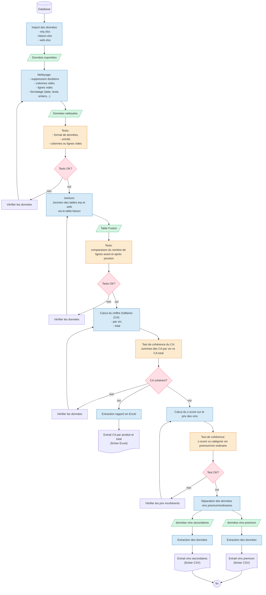
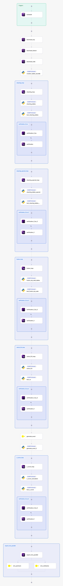
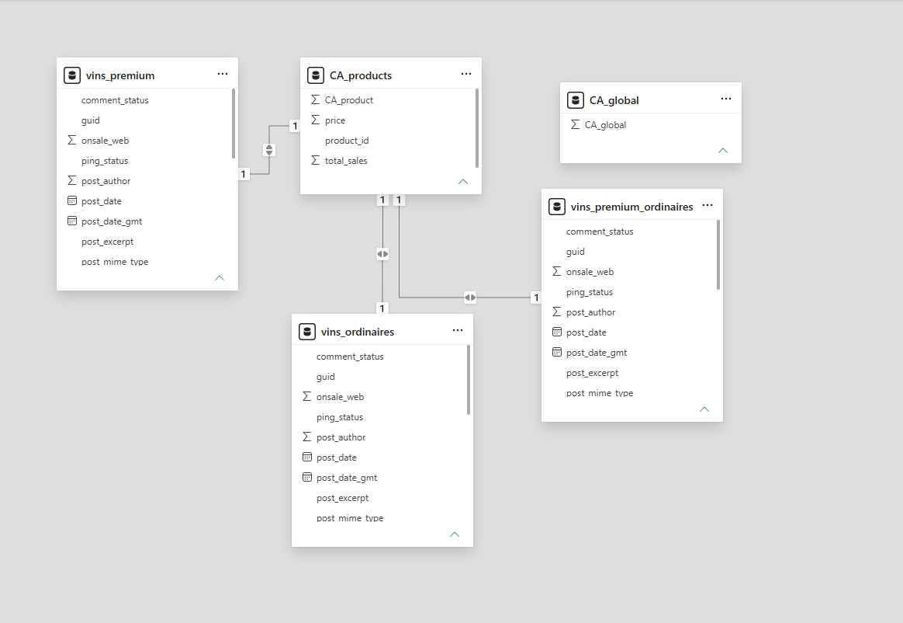
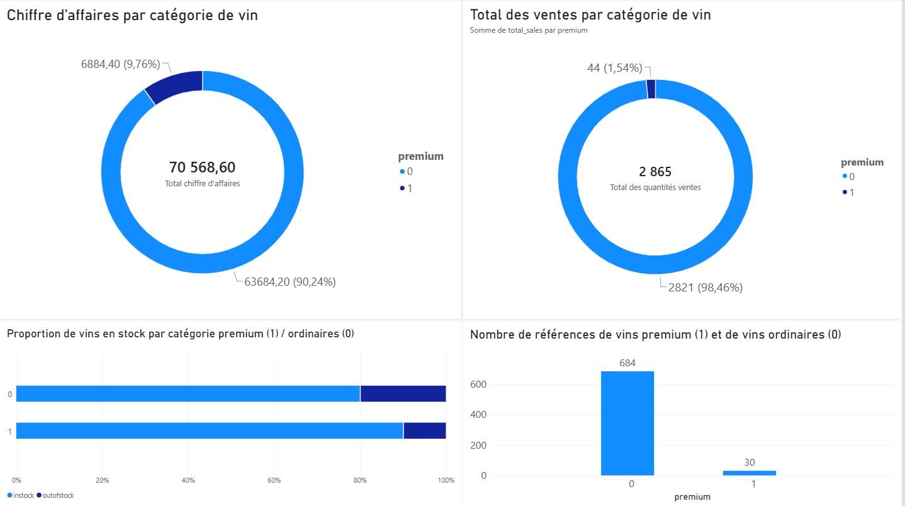
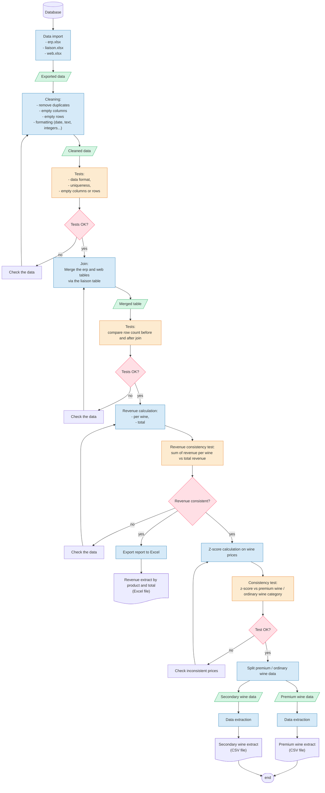

#  BottleNeck – Automatisation ETL & Analyse de données / ETL Automation & Data Analysis

> Projet Data Engineer – Automatisation d'un pipeline de nettoyage, réconciliation et analyse de données de vente pour un marchand de vin.
> Data Engineer project – Automation of a cleaning, reconciliation and analysis pipeline for a wine merchant's sales data.

---

## 🇫🇷 Français

### Contexte

BottleNeck est un marchand de vin qui dispose de deux systèmes sources : un **CMS** (site web) et un **ERP**. Un premier travail manuel d'analyse (nettoyage, réconciliation, calcul du chiffre d'affaires, identification des vins premium via le z-score) avait été réalisé par un data analyst. L'objectif de ce projet est **d'automatiser l'ensemble de cette chaîne de traitement** afin que les équipes produit reçoivent chaque mois, sans intervention manuelle :

- un rapport du chiffre d'affaires (par produit et global) ;
- un extrait des vins **premium** ;
- un extrait des vins **ordinaires**.

### Ce que fait le pipeline

1. **Extraction** des trois fichiers sources (`erp.xlsx`, `liaison.xlsx`, `web.xlsx`) et chargement dans une base **DuckDB**.
2. **Nettoyage générique** : suppression des doublons, des colonnes/lignes entièrement vides, harmonisation des formats (dates, nombres, texte).
3. **Nettoyage métier** : suppression des prix négatifs ou nuls, des lignes de type "attachment" (images), des lignes sans SKU.
4. **Tests de qualité** après chaque étape (format, unicité, valeurs nulles) via **pytest**.
5. **Fusion** des tables ERP et Web via la table de liaison, avec vérification du nombre de lignes avant/après jointure.
6. **Calcul du chiffre d'affaires** par produit et global, avec test de cohérence (somme des CA produits = CA global).
7. **Calcul du z-score** sur le prix des vins pour classer chaque produit en **premium** ou **ordinaire**.
8. **Export** des résultats :
   - un fichier Excel du chiffre d'affaires (deux feuilles : `CA_products` et `CA_global`) ;
   - deux fichiers CSV séparés (`vins_premium.csv`, `vins_ordinaires.csv`).
9. **Orchestration** de l'ensemble du flux avec **Kestra**, incluant une version avec boucles de re-test automatique (`LoopUntil`) et mise en pause en cas d'échec d'un test, ainsi qu'une parallélisation des exports finaux.

### Architecture (Data Lineage)

L'architecture complète du pipeline (import → nettoyage → tests → jointure → calcul du CA → z-score → exports) est détaillée ci-dessous sous forme de diagramme Mermaid, avec à chaque étape critique un point de contrôle qualité et une boucle de correction en cas d'échec.



### Stack technique

| Outil | Rôle |
|---|---|
| **Python** | Scripts de traitement des données |
| **DuckDB** | Base de données analytique locale, requêtée en SQL |
| **pandas / openpyxl** | Calculs et export Excel multi-feuilles |
| **pytest** | Tests automatisés de qualité des données à chaque étape |
| **Kestra** | Orchestrateur de workflow (installation via Docker) |
| **Jupyter Notebook** | Développement, documentation et démonstration du pipeline |

### Installation

Le fichier `requirements.txt` fourni dans le dépôt permet d'installer toutes les dépendances Python nécessaires.

```bash
# 1. Cloner le dépôt
git clone <url-du-depot>
cd <nom-du-depot>

# 2. Créer un environnement virtuel (recommandé)
python -m venv venv
source venv/bin/activate      # sous Windows : venv\Scripts\activate

# 3. Installer les dépendances
pip install -r requirements.txt
```

### Orchestration avec Kestra

Pour exécuter le pipeline complet via Kestra :

```bash
curl -o docker-compose.yml https://raw.githubusercontent.com/kestra-io/kestra/refs/heads/develop/docker-compose.yml
docker compose up -d
```

Puis se rendre sur [http://localhost:8080](http://localhost:8080) pour créer un compte administrateur et importer les flows YAML fournis (version simple et version avec tests intégrés).

**Visualisation du workflow Kestra final**




### Utilisation

- Ouvrir le notebook (`notebook_projet_10.ipynb`) avec Jupyter pour suivre pas à pas la construction du pipeline, tester les scripts en local avec DuckDB, et consulter les résultats intermédiaires.
- Les scripts unitaires (nettoyage, fusion, calcul du CA, z-score) et les scripts de tests `pytest` se trouvent dans les dossiers `scripts/` et `tests/` et sont directement réutilisés par les flows Kestra.
- Le fichier `conftest.py` centralise les fixtures pytest et renvoie automatiquement le résultat des tests à Kestra via `Kestra.outputs()`.

### Tests

Les tests couvrent :
- l'absence de colonnes/lignes entièrement nulles ;
- l'absence de prix négatifs, de lignes "attachment" ou de SKU manquant ;
- la cohérence du nombre de lignes après jointure ERP/Web ;
- la cohérence du chiffre d'affaires (somme par produit = total) ;
- la cohérence de la classification premium/ordinaire par rapport au z-score.

Lancer les tests avec :
```bash
pytest
```
### Visualisation dans PowerBI

**Tables chargées**<br>


**Dashboard** <br>

---

## 🇬🇧 English

### Context

BottleNeck is a wine merchant with two source systems: a **CMS** (website) and an **ERP**. A data analyst had already performed a first manual analysis (cleaning, reconciliation, revenue calculation, premium wine identification using the z-score). The goal of this project is to **automate this entire processing chain** so that product teams receive, every month, without any manual intervention:

- a revenue report (per product and total);
- an extract of **premium** wines;
- an extract of **regular** wines.

### What the pipeline does

1. **Extraction** of the three source files (`erp.xlsx`, `liaison.xlsx`, `web.xlsx`) and loading into a **DuckDB** database.
2. **Generic cleaning**: removal of duplicates, fully empty columns/rows, and format harmonization (dates, numbers, text).
3. **Business-specific cleaning**: removal of negative or zero prices, "attachment" rows (images), and rows with a missing SKU.
4. **Quality tests** after each step (format, uniqueness, null values) using **pytest**.
5. **Merging** the ERP and Web tables through the linking table, with a row-count check before/after the join.
6. **Revenue calculation** per product and overall, with a consistency test (sum of per-product revenue = total revenue).
7. **Z-score calculation** on wine prices to classify each product as **premium** or **regular**.
8. **Export** of the results:
   - an Excel file with the revenue figures (two sheets: `CA_products` and `CA_global`);
   - two separate CSV files (`vins_premium.csv`, `vins_ordinaires.csv`).
9. **Orchestration** of the whole flow with **Kestra**, including a version with automatic retry loops (`LoopUntil`) that pauses the flow when a test fails, plus parallelized final exports.

### Architecture (Data Lineage)

The full pipeline architecture (import → cleaning → tests → join → revenue calculation → z-score → exports) is detailed hereafter as a Mermaid diagram, with a quality checkpoint and a correction loop at each critical step.




### Tech stack

| Tool | Role |
|---|---|
| **Python** | Data processing scripts |
| **DuckDB** | Local analytical database, queried in SQL |
| **pandas / openpyxl** | Calculations and multi-sheet Excel export |
| **pytest** | Automated data-quality tests at each step |
| **Kestra** | Workflow orchestrator (installed via Docker) |
| **Jupyter Notebook** | Development, documentation and demonstration of the pipeline |

### Installation

The `requirements.txt` file included in the repository lets you install all the required Python dependencies.

```bash
# 1. Clone the repository
git clone <repo-url>
cd <repo-name>

# 2. Create a virtual environment (recommended)
python -m venv venv
source venv/bin/activate      # on Windows: venv\Scripts\activate

# 3. Install dependencies
pip install -r requirements.txt
```

### Orchestration with Kestra 

To run the full pipeline through Kestra:

```bash
curl -o docker-compose.yml https://raw.githubusercontent.com/kestra-io/kestra/refs/heads/develop/docker-compose.yml
docker compose up -d
```

Then go to [http://localhost:8080](http://localhost:8080) to create an admin account and import the provided YAML flows (simple version and version with integrated tests).

**Vizualisation of the final Kestra workflow**


### Usage

- Open the notebook (`notebook_projet_10.ipynb`) with Jupyter to follow the pipeline build step by step, test scripts locally with DuckDB, and review intermediate results.
- The individual scripts (cleaning, merging, revenue calculation, z-score) and the `pytest` test scripts live in the `scripts/` and `tests/` folders and are reused directly by the Kestra flows.
- The `conftest.py` file centralizes pytest fixtures and automatically reports test results back to Kestra via `Kestra.outputs()`.

### Tests

Tests cover:
- absence of fully null columns/rows;
- absence of negative prices, "attachment" rows, or missing SKUs;
- row-count consistency after the ERP/Web join;
- revenue consistency (sum per product = total);
- consistency of the premium/regular classification against the z-score.

Run the tests with:
```bash
pytest
```
### Visualization in PowerBI

**Imported Tables** <br>


**Dashboard** <br>

---

## Structure du projet / Project structure

```

│   bottleneck.team.bottleneck_duckdb_flow.yaml         # Flow Kestra simple / Basic Kestra flow
│   bottleneck.team.bottleneck_duckdb_flow_test.yaml    # Flow Kestra avec tests / Kestra flow with tests
│   docker-compose.yml                                  # Installation de Kestra / Kestra installation
│   Dockerfile                                          # Image Kestra custom (duckdb, pytest...) / Custom Kestra image (duckdb, pytest...)
│   notebook_projet_10.ipynb                            # Notebook principal / Main notebook
│   README.md
│   requirements.txt                                    # Dépendances Python / Python dependencies
│
├───scripts                                             # Scripts de traitement utilisés par Kestra / Processing scripts used by Kestra
│       functions_cleaning_tables.py                    # Nettoyage générique / Generic cleaning
│       functions_specific_cleaning_tables.py           # Nettoyage métier / Business-specific cleaning
│       function_creation_tables.py                     # Création des tables DuckDB / DuckDB table creation
│       fusion_tables_liaison.py                        # Jointure ERP/Web/liaison / ERP/Web/linking table join
│       script_z_score.py                               # Calcul du z-score et classification / Z-score calculation and classification
│
└───tests                                                # Tests pytest / Pytest tests
        conftest.py                                     # Fixtures + reporting Kestra / Fixtures + Kestra reporting
        test_ca.py                                      # Test cohérence du chiffre d'affaires / Revenue consistency test
        test_cleaning.py                                # Test nettoyage générique / Generic cleaning test
        test_cleaning_specific.py                       # Test nettoyage métier / Business-specific cleaning test
        test_fusion_erp_web.py                          # Test de la jointure / Join test
        test_z_score.py                                 # Test du z-score / Z-score test
```
